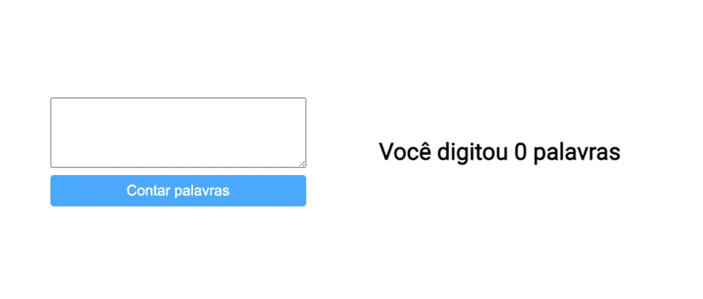

# MINILAB | DOM - Contador de palavras

Neste minilab vamos solidificar os conceitos de seletores do DOM, manipulação de HTML e CSS e eventos de usuário.

## Requerimentos

- Faça um fork deste repositório
- Clone este repositório

## Instruções

O objetivo do exercício é obter o seguinte resultado:

### Passo 1: HTML

Escreva o HTML necessário para obter uma tela parecida com a exemplificada acima. Não se preocupe tanto com estilos por enquanto, foque na funcionalidade. Seu HTML deve conter:

- Um input de texto
- Um botão
- Um texto dizendo 'Você digitou x palavras', onde `x` é a quantidade de palavras digitadas pelo usuário

### Passo 2: Seletores

Use os seletores do DOM para selecionar as tags criadas acima no Javascript. Lembre-se sempre de dar nomes descritivos tanto para seus `ids` quanto para suas variáveis que receberão as referências das tags;

---

**Dica**

Você pode copiar e colar o `id` definido no HTML nos argumentos dos seus seletores para evitar erros de digitação

---

### Passo 3: Reagindo ao evento clique

Crie um `listener` para o evento `click` no seu botão. Quando o botão for clicado, você deve extrair o conteúdo que foi escrito no input de texto e calcular quantas palavras ele possui.

### Passo 4: Manipulando o DOM

Finalmente, atualize o texto 'Você digitou x palavras' para substituir o `x` pela quantidade calculada na etapa anterior

## Entrega

Quando terminar, copie e cole o link do seu repositório (basta copiar a URL atual do seu navegador) na unidade deste exercício no Student Portal (my.ironhack).
